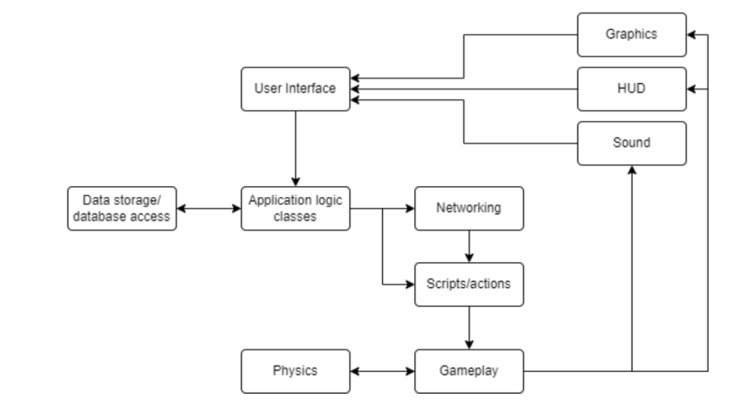
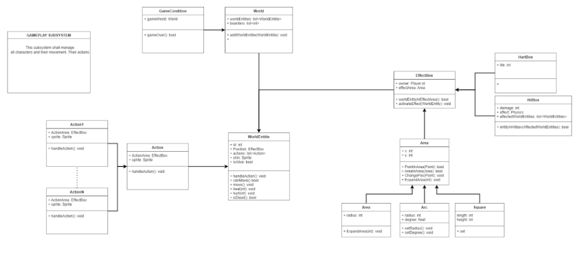

# 12.09.22
## Agenda
1. **Work from last meeting**
2. **Requirements and product backlog**
3. **System architecture and class hierarchy**
4. **Artifacts (if time)**
5. **Hitboxes and knockback (if time)**
6. **Work for next meeting**

## Work from last meeting
* Alle: Tenk på navn til spillet :)
    * Simon: NTNUS (NTNU Smash)
    * Kristoffer: NTNUF (NTNU Fighters)
    * Sverre: Draka kulaka (russisk for kampen av knyttneven)
    * Placeholder navn: NTNU Fighters
* **Sverre: Samarbeider med Simon om Figma for v1. Printer gruppekontrakt når studass har godkjent. Spørre studass om prosjekt er godkjent og om første iterasjon er tilstrekkelig. Kommer også med forslag for klassestruktur.**
    * Figma for login, signup, main menu og settings er good to go. Mangler kun character information og character selection.
        * Character information og character selection må være ferdig innen torsdag 15.09.
    * Studass har godkjent gruppekontrakt, underskriver heller digitalt.
    * Studass greenlighter prosjektet, men mener det kan være mye arbeid. Krever at vi fokuserer på development prosessen og artifacts.
    * Klassestruktur forslag laget, diskusjon senere i møte
* **Kristoffer: Ser på todo-list videoer og ser om det er noe brukbart. Prøver også å se noe på movelist.**
    * Todo-list, mye var guide på den spesifikke appen. Noe kan vi ta til eget prosjekt, mvn, json, gitpod, men en del var spesifikt til todo-list. Mesteparten er kanskje ikke helt relevant. Var også generelt om GUI i JavaFX.
    * Movelist: Gjort en del, det er ikke helt relevant helt enda, kan kanskje fokusere på å progge istedenfor for innlevering 1.
* **Simon: Jobbe videre med animasjon. Samarbeider med Sverre om Figma for v1.**
    * Animasjon: Laget idle, noen normal moves, mål til torsdag: bli ferdig med 2 specials til torsdag 15.09, kan evt. nedprioriteres til fordel for Figma.
    * Figma: samme som Sverre, samarbeider om character information og character selection til torsdag 15.09.
* **Elin: Sette opp brukerhistorie, milestones, issues, board, gitlab ting og maven/gitpod.**
    * User stories: Laget korte setninger mhp. formatet. Trenger kanskje mer utdypelse lignende som den i todo-list. Elin ser på det sammen med Sverre innen torsdag 15.09. Kan lage flere forslag til framtidige user stories.
    * Milestones, issues og board done
        * Burde deles inn i subissues (gjør det som tasks på gitlab): en for controller, en for GUI, en for logikk (model) og en for testing.
        * Så lenge vi dokumenterer og forsvarer hvorfor vi gjør det på denne måten er det greit
        * Kan spørre studass om oppsettet vårt om issues
    * Maven og gitpod funker

## Requirements and product backlog
* As a gamer I want to test my skill against others around the world to see who’s the best.
* As a new player I want to be able to try out new characters before taking them to the battlefield so that I know how to play them.
* As a child who is new to video games I want to get sufficient information and tutorial on how to play so that I can start playing.
* As a player who has played this game a lot I want to get new characters so that I can get a new experience from this game.
* As a player who mistyped my information when creating an account I want to be able to change my account details so that I can log in with my preferred account details.
* As a player with a small screen I would like to be able to change the resolution so that it can fit my computer.
* As a player who wants to be able to talk to my friends online while playing I want to be able to turn down the game volume so that it does not drown out other applications.
* Spørre studass om disse er greie samt forbedringsforslag.
* Project backlog = user stories, velges ut per milestone/sprint, deles opp i issues som deles opp i subtasks

## System architecture and class hierarchy

* User interface: Controller and GUI/JavaFX, det brukeren interagerer med
    * Controller mellom user interface and application logic classes
* Application logic classes: Model
* Scripts/actions: Queue som tar inn inputs og setter dem i riktig rekkefølge, veldig fint for testing
* Gameplay: Model. Provided class hierarchy below, includes characters, world, not “press this to get this move”
* Physics: Gruppe med klasser som gjør vektorregning
* Graphics, HUD og sound: Gameplay sier ifra at noe skjer, sound sier her skal f.eks. skytelyd være, user interface viser det
* Trenger nok noe endring

* Dette må tas opp en annen gang

## Other
* Testing before coding
* Lagringsinterface som tar inn path og lagrer ting, klasse med lagringsmetoder
* Next time: class hierarchy and artifacts, important

## Work for next meeting
* Kristoffer: Leverer inn gruppekontrakt pdf. Skal se på og snakke med Sverre om signup page, begynne å programmere. NB! Lag tester først! Gitpod?
* Simon: Fullfører animasjon og Figma innen torsdag. Character information og character selection må være ferdig innen torsdag 15.09. Skal også se på eksempler på hvordan andre spill implementerer fysikk i JavaFX.
* Sverre: Fullfører Figma innen torsdag. Character information og character selection må være ferdig innen torsdag 15.09. Hjelper også til med user stories til 15.09.
* Elin: Dele issues inn i tasks, user stories, sende epost til studass om issue/task oppsettet vårt funker.
