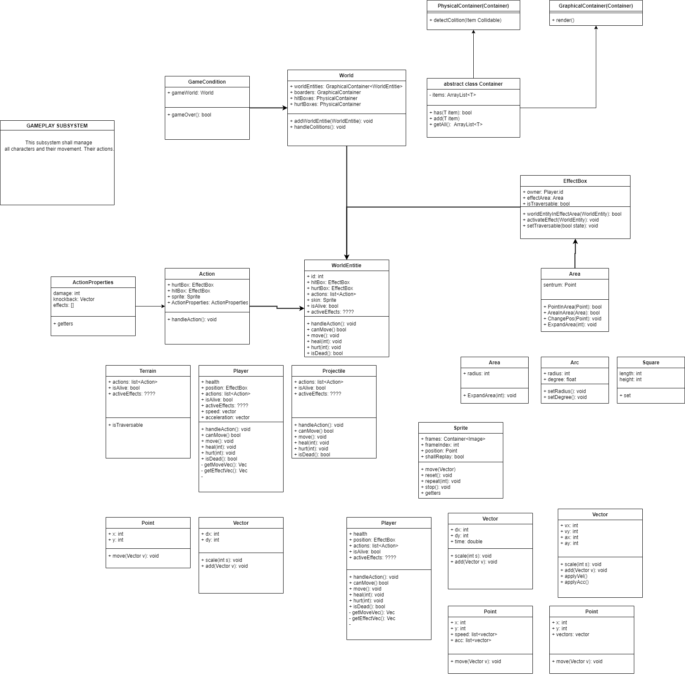

# 10.01.22 Hackathon! :D

## Agenda
1. Workload
2. Diagrams
3. Work for next meeting

## Workload
* Work for next meeting ble aldri satt. Lager noe nå som vi skal jobbe på idag.
* Overview: Hva fungerer og hva fungerer ikke?
* Ting som må gjøres:
    * Signup VS SignUp overalt: Sverre ✓
    * Visibility og feedback på login og signup page: Simon ✓
    * Fix TestFX dependency: Sverre ✓
    * Gitpod tester: Senere
    * Gitpod.yml cd inn og mvn javafx:run: Sverre ✓
    * Module VS package VS class: Sammen ✓
    * Klassediagram for alle modules: In progress
    * Fikse docs kommentarer fra studass: Simon
    * Skriv i README.md hvordan man kjører appen: Simon ✓
    * .gitignore target og allslags drit: Elin ✓
    * Jacoco og testcoverage: Sverre
    * mvn test: Elin ✓
    * Gitpodisering: Simon ✓
        * Gitpod er nede, men har lenke i README.md
    * Jackson og json: Sverre
* Tidsplan:
    * 15-16: Loke
    * 16-20.30: Så. Sykt. Mange. PC issues. Fikset mvn ting i hvert fall.
    * 20.30-23.30: Diagrammer.

## Diagrams
### Modules
* fxui: Det visuelle og controllers i appen, ingen modeller, relaterer kun til det visuelle.
* core: Users og database, JSON skal dit også.
* gameplay: Alt om selve gameplay
    * Sverre: I core istedenfor?
    * Elin: Nei, den relaterer ikke til users og dbAccess. Men core skal liksom inneholde hovedappen though.
    * Elin: Blir vi å trenge mange packages i gameplay egentlig? Er det grunn til at det er modul og ikke en del av core?
        * Kristoffer: Tror det, f.eks. ene delen med hitboxes, koordinatsystem, vektorer, osv. og en annen del er selve karakterene, hit points, effekter, osv.
        * Elin: Kanskje users og dbAccess burde gå i rest? core kan være for gameplay. Nei, rest er vel mer for andre ting.
* rest: REST API og REST server.
    * Lærerne har gjort det, men det har såpass mye med dbAccess å gjøre at det kan passe bedre i core.
    * Passer bra med trelagsstrukturen: visuelt (fxui), domenelogikk (core, gameplay), lagring (rest).
* Skal physics være package eller module?
    * Elin: Den relaterer til bevegelse såpass mye at det bør være en package, de blir nok avhengige av hverandre.
    * Sverre: Tenker physics skal inneholde en vektorklasse og en punktklasse.
    * Kristoffer: Hvordan gjør vi akselerasjon? Det er jo forskjellige derivasjoner.
    * Sverre: Representere akselerasjon gjennom en vektor?
    * Elin: Hvordan påvirker dette om det er en module eller package?
    * Kristoffer: Usikker på om det trenger å være en package, den har kun to ting som evt. må lages.
    * Simon: Vi har nok ikke nok physics til å justify en package i forhold til andre spill.
    * Elin: Kan kanskje bare ha det som klasser i gameplay?
* Elin: Kanskje vi ikke trenger å ha core, men heller kan ha helt andre navn? Forslag: gameplay blir til core, core blir til users eller noe sånt.
    * Kristoffer: Foreslår å heller ha gameplay og users.
    * Elin: Var det jeg egentlig forslo fra starten av men er alle enige? To moduler: gameplay og en annen?
        * Forslag til den andre: menu, users, app, domain, service, base, backend, infrastructure.
        * Avstemning:
            * Sverre: base og gameplay
            * Simon: base og gameplay
            * Kristoffer: core og gameplay
            * Elin: base og gameplay
            * Demokratisk valg: base og gameplay
* Konklusjon: fxui, gameplay, base
### Classes
* Forslag for gameplay so far:
    * World: Inneholder world entities og koordinatfelt, sjekker collisions i verden og delegerer oppgaver. Som en kontroller for logikken.
    * Sjekker dette for hver frame:
        1. Hitbox interagerer med hurtbox
        2. Hurtbox interagerer med hurtbox
    * World entities er både spillere og ting som f.eks. Jonathan Trumpist sin bombe. Forslag: Burde være en superklasse istedenfor at alt er en world entity? Tar en diskusjon på det muntlig.
        * Legge til "isAffectedByGravity"?
        * Deler inn i subklasser, forslag terrain, player og object?
        * Forslag på bevegelsesvektorer: gravity, knockback, egen input
        * Vektorlisten skal være i punktobjekt? Annet forslag er tre gettere i Player. Men kan være lettere med pointklasse som har alt med posisjon å gjøre. Lang diskusjon...
            * Konklusjon etter 40 min: Tre vektorer i pointklasse.
        * Forslag: Vector har vx, vy, ax, ay.
    * Legger til isTraversable på EffectBox
    * Hvert objekt har en hurtbox EffectBox og en hitbox EffectBox
    * Mye diskusjon muntlig, designvalg dokumenteres i ADR og legges i diagram.

## Work for next meeting
* For kort tid til neste møte, jobbet masse i dag, tar heller flere oppgaver på mandagen. Enda ikke laget gitpod testene men slet mye med mvn og slikt, men det går nok kjapt nå som ting endelig funker!

